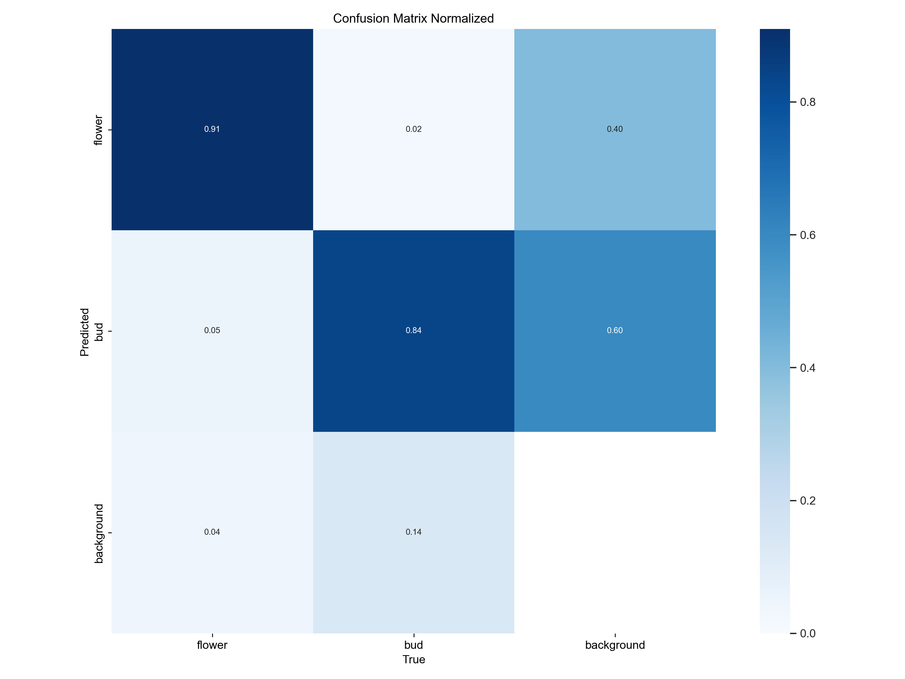
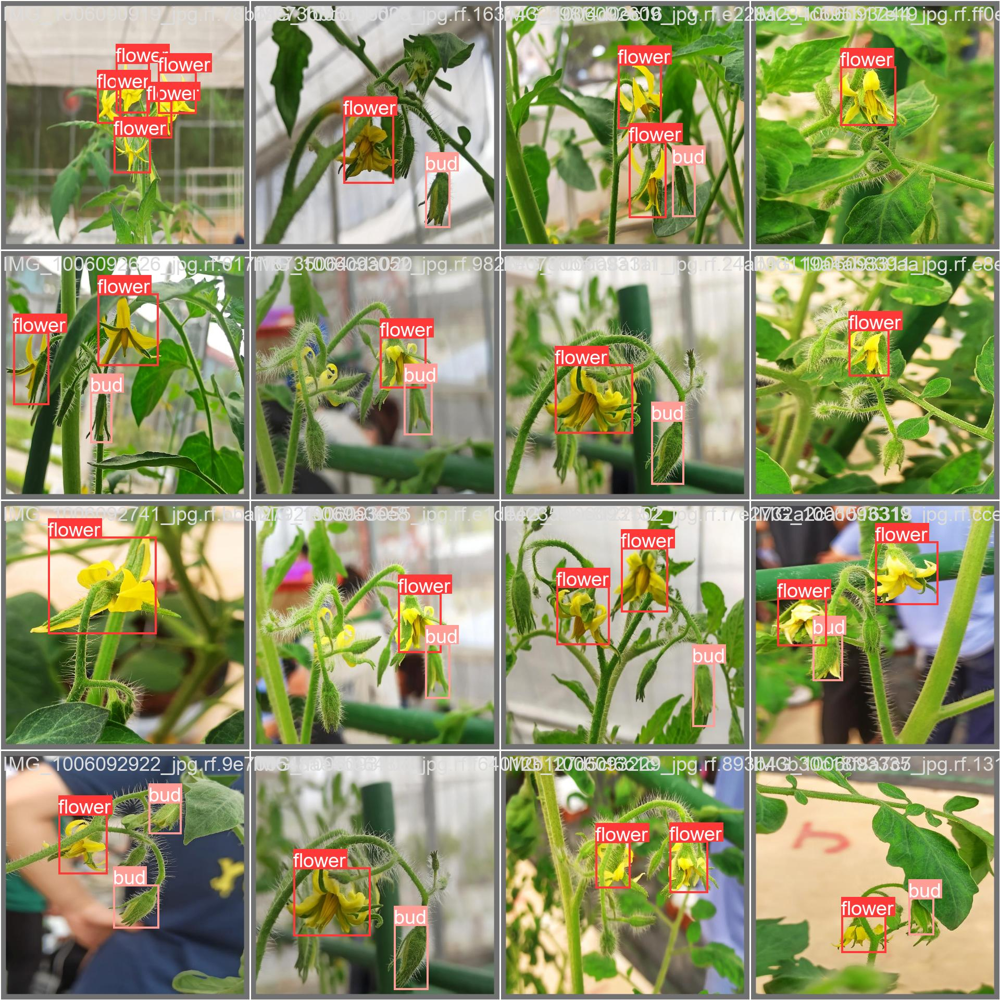
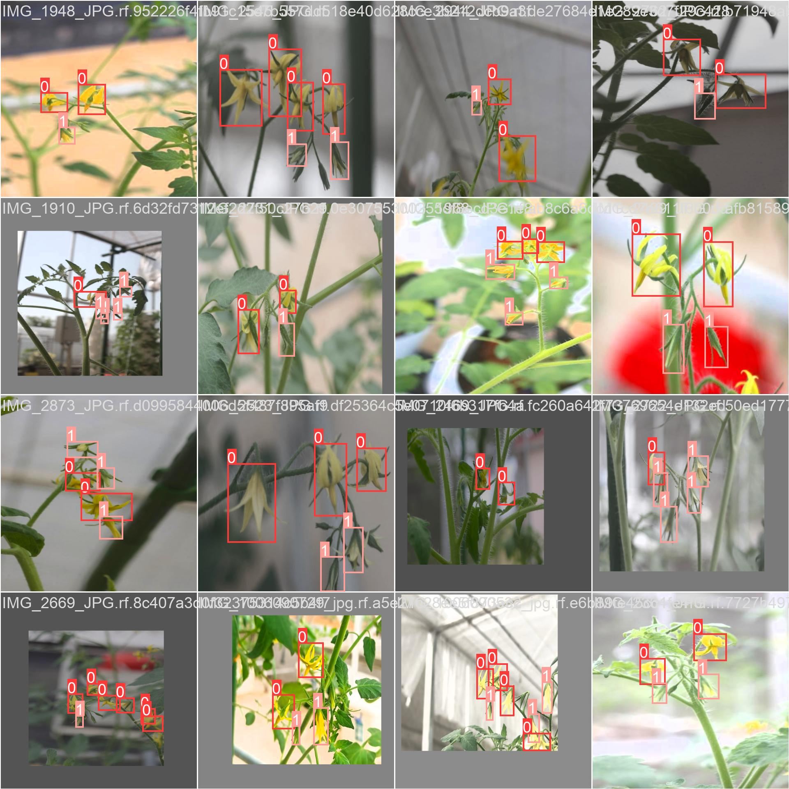

# Tomato_flowers and bud_detection_for_Pollination_Task

This repository contains the Tomato flower and bud detection model for Greenhouse environement, which is used for pollination task.

Dataset link: https://app.roboflow.com/raj-brtgt/flower-fnshn/2594

# Table of Contents

- [Installation](#installation)
- [Download yolov8m weight](#download yolov8m weight)
- [Dataset Preparation](#dataset preparation)
- [Run Tomato flower detection](#run tomato flower detection)
- [Results](#results)
- [Citation](#citation)
- [Acknowledgements](#acknowledgements)

---

# Installation

1. Create virtual environment
   ```bash
   virtualenv env_name --python=python3.10
   ```
2. Activate environment
   ```bash
   env_name\Scripts\activate
   ```
3. Clone this repository:
   ```bash
   get clone https://github.com/rajmeetsng/Tomato_flowers_for_Pollination.git
   cd Tomato_flowers_for_Pollination
   ```
4. Install dependencies:
   ```bash
   pip install -r requirements.txt
   ```

---

# Download Yolov8m weight
Download the weight and save in the Tomato_flowers_for_Pollination folder 
```bash
https://github.com/ultralytics/assets/releases/download/v0.0.0/yolov8m.pt
```

---
# Dataset Preparation

1. Organize your dataset in the following structure:
   ```
   dataset/
   ├── train/
   │   ├── images/
   │   ├── labels/
   ├── val/
   │   ├── images/
   │   ├── labels/
   ```

2. Ensure the annotations are in YOLO format using Roboflow (https://app.roboflow.com/raj-brtgt/flower-fnshn/2594)

3. Update the `config.yaml` file with dataset paths:
   ```yaml
   train: dataset/train/images
   val: dataset/val/images
   nc: 2
   names: ["flower", "bud"]
   ```

# Run Tomato flower detection


```bash
cd Tomato_flowers_for_Pollination
python flower_bud_detection.py

```
---

# Results

  

---

# Citation
If you use this work, please cite:
```
R Singh et al. 2024. Deep learning approach for detecting tomato flowers and buds in greenhouses on 3P2R gantry robot. Scientific Reports, 14(1), p.20552.
```
BibTeX:
```
@article{singh2024deep,
  title={Deep learning approach for detecting tomato flowers and buds in greenhouses on 3P2R gantry robot},
  author={Singh, Rajmeet and Khan, Asim and Seneviratne, Lakmal and Hussain, Irfan},
  journal={Scientific Reports},
  volume={14},
  number={1},
  pages={20552},
  year={2024},

  publisher={Nature Publishing Group UK London}
}
```
---

# Acknowledgements

- YOLOv8: [Ultralytics](https://github.com/ultralytics/yolov8)

---
