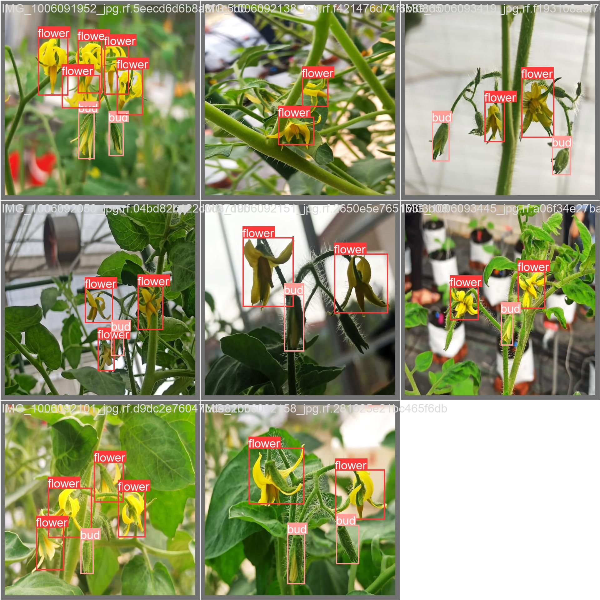

# Tomato_flowers_for_Pollination

This repository contains the Tomato flower dataset from Greenhouse, which is used for pollination task.

Detection dataset link: https://app.roboflow.com/raj-brtgt/flower-fnshn/2594

The code will be released soon.

# Results

  

# Citation
If you use this work, please cite:

Singh, R., Khan, A., Seneviratne, L. and Hussain, I., 2024. Deep learning approach for detecting tomato flowers and buds in greenhouses on 3P2R gantry robot. Scientific Reports, 14(1), p.20552.

BibTeX:
```
@article{singh2024deep,
  title={Deep learning approach for detecting tomato flowers and buds in greenhouses on 3P2R gantry robot},
  author={Singh, Rajmeet and Khan, Asim and Seneviratne, Lakmal and Hussain, Irfan},
  journal={Scientific Reports},
  volume={14},
  number={1},
  pages={20552},
  year={2024},
  publisher={Nature Publishing Group UK London}
}
```

